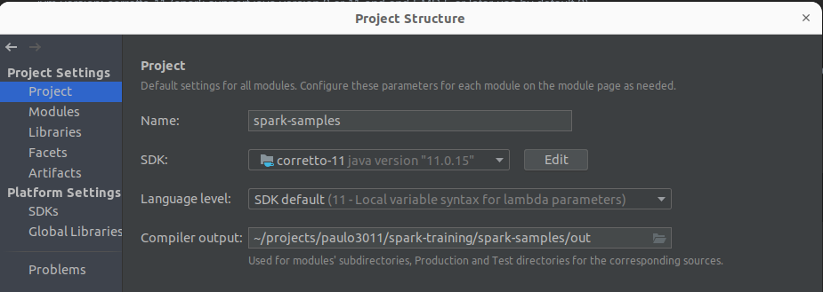

# Introduction

# Getting started

This project was built using:

- gradle-wrapper with gradle version: Gradle 7.1.1 (https://docs.gradle.org/current/userguide/gradle_wrapper.html)
- jvm version: corretto-11 (spark support java version 8 or 11 and ond EMR 5 or later use by default 8)



**Notes**:

- To run this sample it is recommended that you have at least 2GB of RAM, as by default Spark Standalone uses total avalable memory minus 1GB (for the OS)

1. Clone the project

```shell
git clone https://github.com/paulo3011/spark-training.git
```

2. Check gradle wrapper

```shell
cd spark-training
cd spark-samples
# check version
./gradlew --version
# Welcome to Gradle 7.1.1!
# https://docs.gradle.org/7.1.1/dsl/index.html
```

# Git style guide

feat: A new feature
fix: A bug fix
docs: Changes to documentation
style: Formatting, missing semi colons, etc; no code change
refactor: Refactoring production code
test: Adding tests, refactoring test; no production code change
chore: Updating build tasks, package manager configs, etc; no production code change

https://udacity.github.io/git-styleguide/

# Gradle references

https://docs.gradle.org/current/samples/sample_building_java_applications_multi_project.html


# Docker instructions

[docker readme.md](docker/build/README.md)

# Todo

- https://spark.apache.org/docs/0.6.0/tuning.html (kryo, memory size, parallelism, gc tuning)
  - https://spark.apache.org/docs/latest/tuning.html (new method size estimate for memory size)