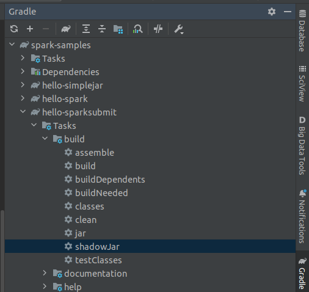

Spark standalone docker cluster usable for testing and development purposes.

1. Build docker images for Spark 3.2.1

```shell
docker build -t spark-test-base base/
docker build -t spark-test-master master/
docker build -t spark-test-worker worker/
```

2. Run docker compose

Clear volume files:

```shell
cd ./../data/
chmod +x clean.sh 
sudo ./clean.sh
```
Start docker compose:

```shell
docker compose up
```

3. Check if the apps are present in master node

```shell
# log into master shell
docker exec -it spark-master bash
# check if the apps are present
ls /opt/spark-apps
```


```shell
# log into master shell
docker exec -it spark-worker-a bash
```

4. Submit a sample spark jar application in cluster mode

```shell
docker exec -it spark-master bash
spark-submit --class net.pmoreira.samples.spark.hello.SparkSubmit --deploy-mode cluster --master spark://spark-master:7077 /opt/spark-apps/hello-sparksubmit-all.jar
```

5. Open in browser http://localhost:4747 or http://localhost:4848 or http://localhost:4949 to see the Driver UI
   
Note: spark job will sleep for 3 minutes and then will finish

6. Submit a sample spark jar application in client mode from master node

```shell
docker exec -it spark-master bash
spark-submit --class net.pmoreira.samples.spark.hello.SparkSubmit --deploy-mode client --master spark://spark-master:7077 /opt/spark-apps/hello-sparksubmit-all.jar
```

Open in browser http://localhost:4747/ to see the Driver UI


7. Debug with intellij remote debug
   1. Run shadow jar for hello-sparksubmit module
   
   
   
   2. The gradle task will copy the fat jar to spark-samples/docker/apps
   3. Start the spark application on the master node
   
    ```shell
   docker exec -it spark-master bash
    spark-submit --class net.pmoreira.samples.spark.hello.SparkSubmit \
    --deploy-mode client \
    --master spark://spark-master:7077 \
    --conf "spark.driver.extraJavaOptions=-agentlib:jdwp=transport=dt_socket,server=y,suspend=y,address=*:5005" \
    /opt/spark-apps/hello-sparksubmit-all.jar 
    ```
   
   Note: the address (e.g address=*:5005) format in spark.driver.extraJavaOptions needs to be in the format expected by the JDK version. See also: 
   - https://stackoverflow.com/questions/46662125/remote-debugging-java-9-in-a-docker-container-from-intellij-idea/47772365#47772365
   - https://medium.com/agile-lab-engineering/spark-remote-debugging-371a1a8c44a8
   - https://spark.apache.org/developer-tools.html (other way of Debug Spark remotely)
   

   


   4. Configure the intellij run configuration for remote debug
   
   ```txt
   -agentlib:jdwp=transport=dt_socket,server=y,suspend=n,address=*:5005
   ```

   
   
   5. Click on debug icon

   

   

   6. Go to spark master UI to see the app running

   

2. Reset the cluster

```shell
docker compose down
```

```shell
cd ./../data/
chmod +x clean.sh 
sudo ./clean.sh
```

```shell
docker compose up
```

# References

This standalone docker-compose was made based on: https://github.com/apache/spark/tree/v3.2.0/external/docker/spark-test
	

