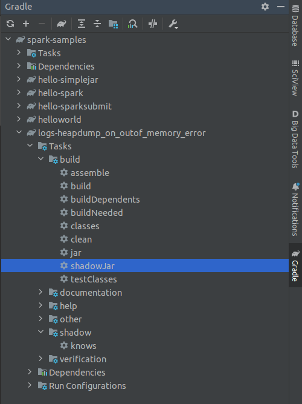

# Goals

This sample was designed with the following objectives:

- Demonstrate how to configure the driver program and executors to capture GC logs and heapdump, so you can tune the jvm or troubleshoot
- Emulate a java.lang.OutOfMemoryError: Java heap space
- Demonstrate how to Kill the application on OnOutOfMemoryError
- Demonstrate the right place to set driver java options
- Demonstrate how to persist driver logs

## Getting started

1. Run the gradle task shadowJar to build the fat jar and copy it to spark-app volume

2. Start the docker-compose
```shell
cd ../docker/build/
docker-compose up
```

# To save the logs and heapdump in a custom dir:

```shell
docker exec -it spark-master bash
spark-submit --master spark://spark-master:7077 \
--class net.pmoreira.samples.spark.logs.heapdump.App \
--verbose \
--deploy-mode client \
--driver-memory 1g \
--driver-cores 1 \
--driver-java-options "-verbose:gc -Xlog:gc=debug:file=/opt/spark/logs/drivergclog.txt -XX:+HeapDumpOnOutOfMemoryError -XX:HeapDumpPath=/opt/spark/logs/driverheapdumpsfile -XX:OnOutOfMemoryError='kill -9 %p'" \
--executor-memory 1g \
--total-executor-cores 4 \
--executor-cores 2 \
--conf "spark.executor.extraJavaOptions=-verbose:gc -Xlog:gc=debug:file=/opt/spark/logs/executorgclog.txt -XX:+HeapDumpOnOutOfMemoryError -XX:HeapDumpPath=/opt/spark/logs/executorheapdumpsfile -XX:OnOutOfMemoryError='kill -9 %p'" \
/opt/spark-apps/logs-heapdump_on_outof_memory_error-all.jar
```

## View the logs and heapdump files

```shell
docker exec -it spark-master bash
ls /opt/spark/logs/
head -n 2 /opt/spark/logs/drivergclog.txt
head -n 1 /opt/spark/logs/driverheapdumpsfile
```

## Notes

### How to configure the number of executors on standalone cluster

To control the executors on standalone mode use spark-submit --total-executor-cores (or spark.cores.max --conf) and --executor-cores together.
For example, if you want 2 executors with 2 cores each:

```txt
--conf "spark.cores.max=4" --conf "spark.executor.cores=2"
or
--total-executor-core 4 --executor-cores 2
```

### Where to set spark.driver.extraJavaOptions

In client mode, spark.driver.extraJavaOptions config must not be set through the SparkConf directly in your application, 
because the driver JVM has already started at that point. Instead, please set this through the --driver-java-options command line option 
or in your default properties file. 

seealso: https://spark.apache.org/docs/latest/configuration.html

### What are the heap dump settings:

- HeapDumpOnOutOfMemoryError: Dump heap to file when java.lang.OutOfMemoryError is thrown from JVM
- HeapDumpPath: When HeapDumpOnOutOfMemoryError is on, the path (filename or directory) of the dump file (defaults to java_pid.hprof in the working directory)
- seealso: https://chriswhocodes.com/corretto_jdk11_options.html

Note: For workers on standalone clusters the default execution and log directory is SPARK_HOME/work. You can change this by SPARK_WORKER_DIR env.
See spark.local.dir for other cluster mode (https://spark.apache.org/docs/latest/configuration.html).

# To save the logs and heapdump in default directories:

```shell
docker exec -it spark-master bash
spark-submit --master spark://spark-master:7077 \
--class net.pmoreira.samples.spark.logs.heapdump.App \
--verbose \
--deploy-mode client \
--driver-memory 1g \
--driver-cores 1 \
--driver-java-options "-verbose:gc -Xlog:gc=debug:file=drivergclog-defaultdir.txt -XX:+HeapDumpOnOutOfMemoryError -XX:HeapDumpPath=driver-heapdump -XX:OnOutOfMemoryError='kill -9 %p'" \
--executor-memory 1g \
--total-executor-cores 4 \
--executor-cores 2 \
--conf "spark.executor.extraJavaOptions=-verbose:gc -Xlog:gc=debug:file=executorgclog-defaultdir.txt -XX:+HeapDumpOnOutOfMemoryError -XX:HeapDumpPath=executor-heapdump -XX:OnOutOfMemoryError='kill -9 %p'" \
/opt/spark-apps/logs-heapdump_on_outof_memory_error-all.jar
```

## View the logs and heapdump files

```shell
docker exec -it spark-master bash
ls /opt/spark
head -n 2 drivergclog-defaultdir.txt
head -n 1 driver-heapdump
```

# To persist driver logs

```shell
docker exec -it spark-master bash
spark-submit --master spark://spark-master:7077 \
--class net.pmoreira.samples.spark.logs.heapdump.App \
--verbose \
--deploy-mode client \
--driver-memory 1g \
--driver-cores 1 \
--driver-java-options "-XX:OnOutOfMemoryError='kill -9 %p'" \
--conf spark.driver.log.persistToDfs.enabled=true \
--conf spark.driver.log.dfsDir=/opt/spark/logs/ \
--executor-memory 1g \
--total-executor-cores 4 \
--executor-cores 2 \
/opt/spark-apps/logs-heapdump_on_outof_memory_error-all.jar
```

## Notes

### Driver logs on client mode

By the default they are not persistent, so you need to set spark.driver.log.persistToDfs.enabled to true and set a directory (spark.driver.log.dfsDir) to store the logs.

## To view the driver logs

```shell
docker exec -it spark-master bash
ls logs/
```

If the driver file is empty, search in /tmp/spark-.. dirs the driver's log:

```shell
docker exec -it spark-master bash
find /tmp/ -name 'driver.log'
```


# Tips

## JVM Options

To list the advanced jvm options use: 

```shell
java -XX:+UnlockDiagnosticVMOptions -XX:+PrintFlagsFinal -version
```

To see how to use Xlog execute:

```shell
# jvm 9 or later
java -Xlog:help -version
```

```shell
# jvm 8 
java -Xloggc:help -version
```

To create manualy a small gc log file execute:

```shell
java -Xlog:gc=debug:file=/tmp/test-log.txt --version
cat /tmp/test-log.txt
```

seealso: https://opensource.com/article/22/4/jvm-parameters-java-developers

## GC logs analysis sample

https://blog.gceasy.io/2020/03/18/7-jvm-arguments-of-highly-effective-applications/

## How to analyze GC log:

1. Go to https://gceasy.io/gc-index.jsp
2. Browse the gc file log
3. Click analyze

## How to analyze heapdump:

1. Go to https://visualvm.github.io
2. Download the visualvm
3. Start the visualvm app
4. Click em File/Load and select the heapdump file

## To enable verbose gc logging to a file named for the executor ID of the app in /tmp, pass a value of:

### for jvm 8

```shell
spark-submit ...
--conf "spark.executor.extraJavaOptions=-verbose:gc -Xloggc:/tmp/-.gc" 
```

### for jvm 9 or later

```shell
spark-submit ...
--conf "spark.executor.extraJavaOptions=-verbose:gc -Xlog:/tmp/-.gc" 
```