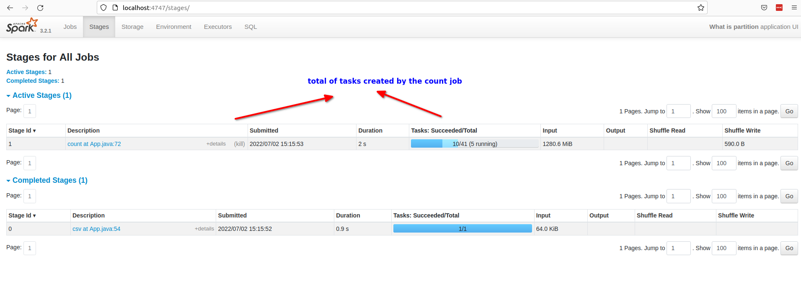
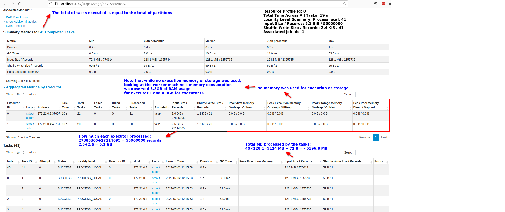

# Spark concepts - Partition

## What is a partition in Spark?

Spark breaks up the data into chunks called partitions.
Is a collection of rows that sit on one physical machine in the cluster.
Default partition size is 128MB.
Allow every executor perform work in parallel.
One partition will have  a parallelism of only one, even if you have many executors.

With many partitions and only one executor will give you a parallelism of only one.
You need to balance the number of executors and partitions to have the desired parallelism. 
This means that each partition will be processed by only one executor (1 executor for 1 partition for 1 task at a time).

A good rule is that the number of partitions should be larger than the number of executors on your cluster

See also:
Chambers, Bill; Zaharia, Matei. Spark: The Definitive Guide: Big Data Processing Made Simple (p. 27). O'Reilly Media. Edição do Kindle.

Note: Cores are slot for tasks, and each executor can process more than one partition at a time if it has more than one core.

## What types of partitions exists?

### Input partitions (size control)

When the file is splittable, spark will break the file into the input partition size which by default is 128 MB (spark.sql.files.maxPartitionBytes).
When the file is not splittable, each file will result in 1 partition.
Sample of splittable files are: csv (in its simpliest form, spark can split the csv file into many partitions), avro, parquet, orc.

Note: spark.sql.files.maxPartitionBytes -> The maximum number of bytes to pack into a single partition when reading files. It affects only read transformations (for example read a parquet file)

### Shuffle partitions (count control)

It is the partitions resulting of a shuffling operation like aggregation, sort and joins.
Will have input partitions contributing to many output partitions.

We can control only the number (count) of partitions using spark.sql.shuffle.partitions.

Tip: we can use spark.sql.shuffle.partitions to control the number of output partitions to set the desired number of files
if the shuffling stage is the last.

Note: For all shuffle operations, Spark writes the data to stable storage (e.g., disk), and can reuse it across multiple jobs.
Chambers, Bill; Zaharia, Matei. Spark: The Definitive Guide: Big Data Processing Made Simple (p. 329). O'Reilly Media. Edição do Kindle.

### Output partitions (size control)

It is the final result of the spark computation (output files).
It is the result of the last stage.

Reasons to change the output partitions number:

- To achieve the desired file size
- To increase parallelism

We can use to control:

- coalesce(n) to shrink (merge partitions on the same node)
- repartition(n) to increase or balance (going to use shuffle and that's expensive)
- df.write.option("spark.sql.files.maxRecordsPerFile", n)

See also: https://spark.apache.org/docs/latest/configuration.html

## How we can process a partition?

1. __Spark always operate on the entire partition individually__
2. We can use functions from RDD and Dataframe API like map, mapPartitions and flatMap
   1. map
      - Allows to operate on each row of the partition
   2. mapPartitions
      - Allows us to perform an operation on that entire partition. 
      - This is valuable for performing something on an entire subdataset of your RDD (each partition represented as an iterator).
   3. flatMap 
      - Similar to map, but each input item can be mapped to 0 or more output items (so func should return a Seq rather than a single item)
3. Map is an alias to mapPartitions
4. You can gather all values of a partition class or group into one partition and then operate on that entire group using arbitrary functions and controls.

Chambers, Bill; Zaharia, Matei. Spark: The Definitive Guide: Big Data Processing Made Simple (p. 282). O'Reilly Media. Edição do Kindle.

# Case study 01 - reading one 5.4 GB csv file and checking input partitions

Emulate one file with about +- 5.192GB (csv)

Run the man function of java/net/pmoreira/samples/spark/partition/whatis/FakeCsvWriter.java to create the file.
Save the file in: /opt/spark-data/hugefile.csv

1. Configure the cluster to:
   1. 1 GB for each executor
   2. 4 cores for all executors, and 2 cores per executor => 4/2 = 2 executors
   3. This will give us 2 GB of memory to process 5.1 GB
   4. In spark 3.2.1
      1. 60% of (JVM HEAP - 300 MB) **is the spark memory fraction**
         1. (1000MB-300MB) x 0.60 = 420 MB, this 50% (210 MB) is for execution and 50% (210 MB) is for storage (cache)
      2. 40% of (JVM HEAP - 300 MB) **is for spark and user data**
         1. (1000MB-300MB) x 0.40 = 280 MB
   5. Splitting spark memory to available slots for tasks (cores), we have:
      1. 420 MB/2 cores per executor = 210 MB per core 
         1. => in spark 3.2.1, by default 60% execution and 40% storage 
            1. => 210 MB x 0.6 => 126 MB for execution and 84 MB for storage for each core (task slot)

2. Emulate read this file and see how many partitions will be created (input partitions). 
   1. default input partitions is 128 MB (reading files), then
   2. 5192/128 = 40,56 partitions (41)

Run this run a job to count the number of partitions will be created on read the file.

Job parameters:

* if args has --getNumInputPartitions will run df.rdd().getNumPartitions() action to count input partitions
* if args has --triggerCount will execute count action on the dataset to count number of records
* if args has --checkpointDataset will persist the dataset to disk to be able to see on disk the total of input partitions
* if args has --eagerCheckpoint and --checkpointDataset will persist the dataset to disk immediately before any action
* if args has --sleepSeconds [number], i.e --sleepSeconds 90 at the end will sleep to keep the spark ui a live for 90 seconds

```shell
docker exec -it spark-master bash
spark-submit --class net.pmoreira.samples.spark.partition.whatis.App \
--deploy-mode client \
--master spark://spark-master:7077 \
--verbose \
--driver-memory 3g \
--driver-cores 1 \
--driver-java-options "-XX:OnOutOfMemoryError='kill -9 %p'" \
--conf spark.driver.log.persistToDfs.enabled=true \
--conf spark.driver.log.dfsDir=/opt/spark/logs/ \
--conf "spark.executor.extraJavaOptions=-verbose:gc -Xlog:gc=debug:file=/opt/spark/logs/-executorgclog.txt -XX:OnOutOfMemoryError='kill -9 %p'" \
--executor-memory 1g \
--total-executor-cores 4 \
--executor-cores 2 \
/opt/spark-apps/partition-whatis-all.jar --getNumInputPartitions --sleepSeconds 300
```

Go to http://localhost:4747/ to see that one job was triggered and look at the logs to see something like:

```shell
# 22/06/25 15:23:07 INFO FileSourceScanExec: Planning scan with bin packing, max size: 134217728 bytes, open cost is considered as scanning 4194304 bytes.
# Estimated total partitions: 41
```

Note that in the output log it was shown "...Planning scan with bin packing, max size: 134217728 bytes" = 128 MB

3. Try the count action to check how many jobs will be created and how many tasks will be performed

```shell
docker exec -it spark-master bash
spark-submit --class net.pmoreira.samples.spark.partition.whatis.App \
--deploy-mode client \
--master spark://spark-master:7077 \
--verbose \
--driver-memory 3g \
--driver-cores 1 \
--driver-java-options "-XX:OnOutOfMemoryError='kill -9 %p'" \
--conf spark.driver.log.persistToDfs.enabled=true \
--conf spark.driver.log.dfsDir=/opt/spark/logs/ \
--conf "spark.executor.extraJavaOptions=-verbose:gc -Xlog:gc=debug:file=/opt/spark/logs/-executorgclog.txt -XX:OnOutOfMemoryError='kill -9 %p'" \
--executor-memory 1g \
--total-executor-cores 4 \
--executor-cores 2 \
/opt/spark-apps/partition-whatis-all.jar --triggerCount --sleepSeconds 600
```






Todo:

- create a group by operation to see if will result in partitions with diferent size depend on group by
- create a map operation to see execution memory in use in each task
- if I double the executor memory what will be the impact on GC logs (141M->43M(502M), 502M will double?)


# Case study 02 - Emulate spill do disk, shuffle and how to solve calculating the spark.sql.shuffle.partitions size

2. Configure the cluster to:
   1. 20 GB for executors (10 GB each)
   2. 7 cores for executors, and 1 cores per executor => 7/1 = 7 executors
   3. 20/7 = 2.85 GB per core => 1.428 GB for execution and 1.428 GB for storage
3. Emulate read this file and see how many partitions will be created (input partitions). Discovery how to see this.
   1. default input partitions is 128 MB (reading files), then
   2. 5400/128 = 42,18 partitions
   3. try count action to check this
4. Emulate one shuffle (sort) with shuffle partitions size set with custom value. If we want shuffle partitions around 300 MB, then:
   1. 5000/300 = 16.6 (partitions)
   2. 16.6 partitions / 7 cores = 2.37 => more than two partitions per core. Then 7x2 = 14 (desirable partitions)
   3. 14 partitions with 7 cores means we will have 2 cycles of executions because 16.6 - 14 = 2.6 (more than 2 partition will run in the second cycle)
   4. set spark.sql.shuffle.partitions to 14
   5. Check for spillage to disk
5. Then, emulate another configuration to eliminate the spill
   1. 20 GB for executors
   2. 7 cores for executors, and 1 cores per executor => 7/1 = 7 executors
   3. 20/7 = 2.85 GB per core => 1.428 GB for execution and 1.428 GB for storage
   4. Partitions shuffle
      1. 5000/100 = 50 (partitions)
      2. 50/7 = 7.14 => 7x7 = 49 (desirable partitions)
      3. 50-49 = 1 (one partition left for the second cycle)
      4. set spark.sql.shuffle.partitions to 49
      5. Check for spillage to disk
      6. Check if the size that matters is the full size of dataset, in that case 5GB and even though the input partition is 128 MB our shuffle partition calculation was important


```shell
docker exec -it spark-master bash
spark-submit --class net.pmoreira.samples.spark.partition.whatis.App \
--deploy-mode client \
--master spark://spark-master:7077 \
--verbose \
--driver-memory 3g \
--driver-cores 1 \
--driver-java-options "-XX:OnOutOfMemoryError='kill -9 %p'" \
--conf spark.driver.log.persistToDfs.enabled=true \
--conf spark.driver.log.dfsDir=/opt/spark/logs/ \
--conf "spark.executor.extraJavaOptions=-verbose:gc -Xlog:gc=debug:file=/opt/spark/logs/-executorgclog.txt -XX:OnOutOfMemoryError='kill -9 %p'" \
--executor-memory 1g \
--total-executor-cores 1 \
--executor-cores 1 \
/opt/spark-apps/partition-whatis-all.jar
```