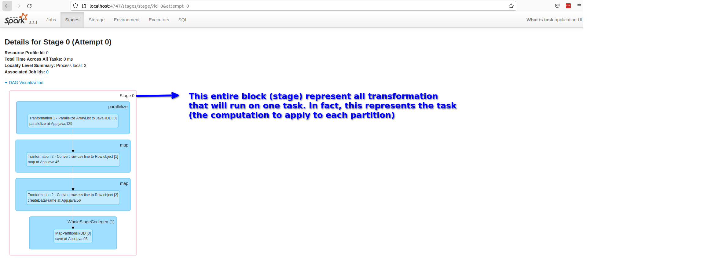
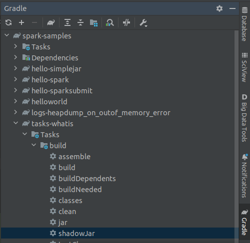
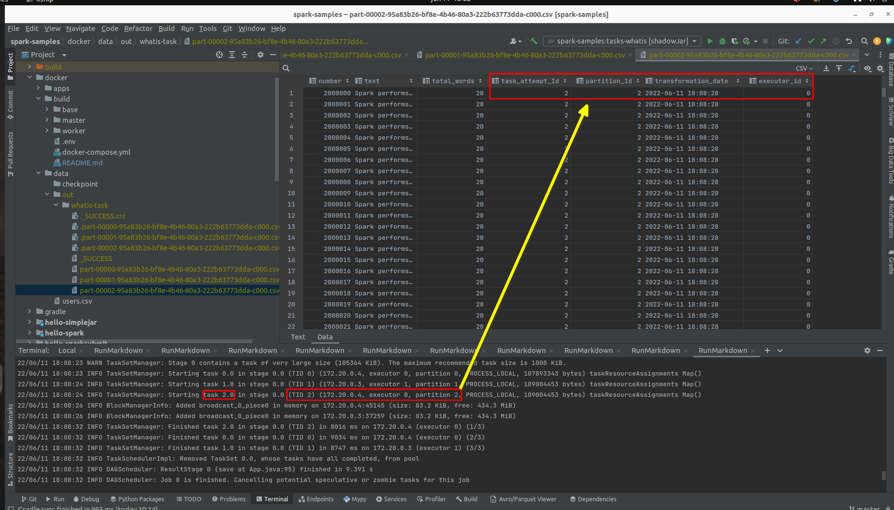
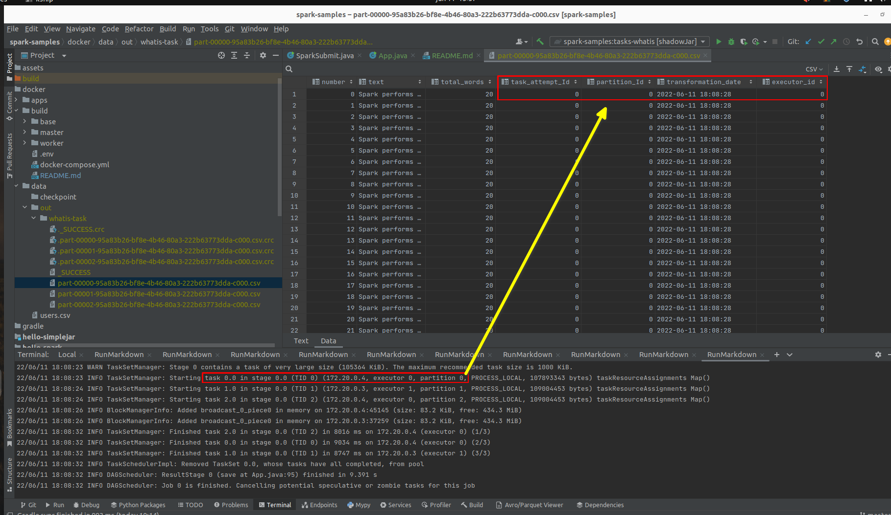
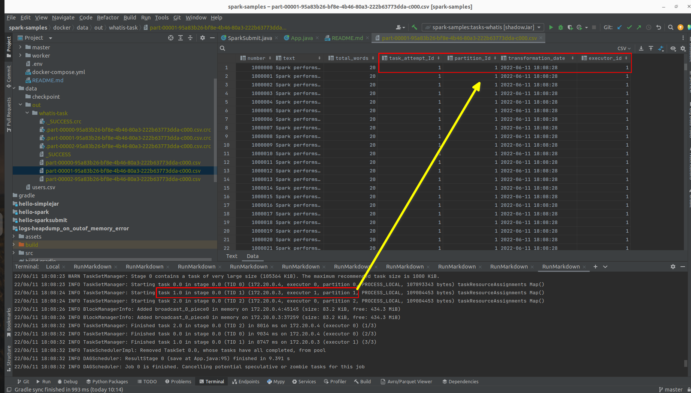
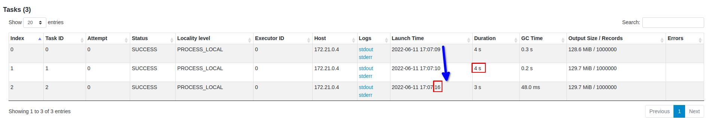

# Spark concepts - Task

## What is a task in Spark? 

Each task corresponds to a combination of blocks of data (partition) and a __set of transformation that will run on a single
executor__.

- Task is just a unit of computation (set of transformation) applied to a unit of data (the partition).
- If there are 1000 little partitions, we will have 1000 tasks __that can be executed in parallel__.
- If there is one big partition, we will have 1 task.

Chambers, Bill; Zaharia, Matei. Spark: The Definitive Guide: Big Data Processing Made Simple (p. 328). O'Reilly Media. Edição do Kindle.

This means:

- Only one executor can process any partition at a time. In Spark there won't be two different executors processing the same partition.
- Only one task (the stage task) can process any partition at a time (1 executor processing 1 partition by 1 task at time)
- The number of task on each stage will depend on the number of partitions

Note: The number of parallel task that can run on each executor depends on the number of cores (cpu) each executor has.


### spark.default.parallelism

**Default number of partitions in RDDs returned by transformations** like join, reduceByKey, and parallelize when not set by user.

https://spark.apache.org/docs/latest/configuration.html

**Spark automatically sets the number** of “map” tasks to run on each file according to its size.
and for distributed “reduce” operations, such as groupByKey and reduceByKey, it uses the largest parent RDD’s number of partitions.

https://spark.apache.org/docs/latest/tuning.html

This doesn't change the fact that to process partitions in parallel we need more cores (1 partition per core per executor)

## What is job?

Set of transformations triggered by an individual action, before the trigger it is called dag.
Each job breaks down into a series of stages.

## What is stage?

__Stages represent groups of tasks that can be executed together to compute the same operation__ on multiple machines
and don’t require shuffle. Spark will try to pack as much transformation as possible into the same stage.

Chambers, Bill; Zaharia, Matei. Spark: The Definitive Guide: Big Data Processing Made Simple (p. 327). O'Reilly Media. Edição do Kindle.

The number of Stages depends on how many shuffle operations will be necessary.
Each shuffle operation will create one new stage.

For all shuffle operations, Spark writes the data to stable storage (e.g., disk), and can reuse it across multiple jobs.

Chambers, Bill; Zaharia, Matei. Spark: The Definitive Guide: Big Data Processing Made Simple (p. 329). O'Reilly Media. Edição do Kindle.

## How to visualize how many transformations are executed in one task?

In the Spark Driver UI, you can view the visual representation of the stage.
Everything inside the stage (all transformation) is what one task will run at one partition.



Run the gradle task "shadowJar" to build the fat jar and copy the jar to the docker volume.



Submit the sample spark jar application (tasks-whatis-all.jar) in client mode from master node

```shell
docker exec -it spark-master bash
spark-submit --class net.pmoreira.samples.spark.tasks.whatis.App \
--deploy-mode client \
--master spark://spark-master:7077 \
--verbose \
--driver-memory 3g \
--driver-cores 1 \
--driver-java-options "-XX:OnOutOfMemoryError='kill -9 %p'" \
--conf spark.driver.log.persistToDfs.enabled=true \
--conf spark.driver.log.dfsDir=/opt/spark/logs/ \
--conf "spark.executor.extraJavaOptions=-verbose:gc -Xlog:gc=debug:file=/opt/spark/logs/-executorgclog.txt -XX:OnOutOfMemoryError='kill -9 %p'" \
--executor-memory 1g \
--total-executor-cores 4 \
--executor-cores 2 \
/opt/spark-apps/tasks-whatis-all.jar
```

Open in browser http://localhost:4747/ to see the Driver UI

Notes:

- --total-executor-cores 4 (limits the maximum cores used by all executors to 4 cores)
- --executor-cores 2 (gives 2 cores for each executor. That will give us 2 executors because the limit set in total-executor-cores)


## Analyzing the output files







## Analyzing the output logs from a sample execution:

```txt
22/06/11 18:08:16 INFO StandaloneSchedulerBackend: SchedulerBackend is ready for scheduling beginning after reached minRegisteredResourcesRatio: 0.0
Started sparksession
Started JavaSparkContext
22/06/11 18:08:18 INFO CoarseGrainedSchedulerBackend$DriverEndpoint: Registered executor NettyRpcEndpointRef(spark-client://Executor) (172.20.0.4:59586) with ID 0,  ResourceProfileId 0
22/06/11 18:08:18 INFO CoarseGrainedSchedulerBackend$DriverEndpoint: Registered executor NettyRpcEndpointRef(spark-client://Executor) (172.20.0.3:52812) with ID 1,  ResourceProfileId 0
22/06/11 18:08:18 INFO BlockManagerMasterEndpoint: Registering block manager 172.20.0.4:45145 with 434.4 MiB RAM, BlockManagerId(0, 172.20.0.4, 45145, None)
22/06/11 18:08:18 INFO BlockManagerMasterEndpoint: Registering block manager 172.20.0.3:37259 with 434.4 MiB RAM, BlockManagerId(1, 172.20.0.3, 37259, None)
Created arraylist, will parallelize to create RDD with 3 partitions
Created JavaRDD with 3 partitions 
22/06/11 18:08:20 INFO SharedState: Setting hive.metastore.warehouse.dir ('null') to the value of spark.sql.warehouse.dir.
```

In the log above, we can see that we created an input dataset with 3 partitions.

## Conclusion

Each executor + core (cpu) can process one partition at time.
If we have 2 executor and 2 cores for each executor, will be possible to process 4 partition in parallel.

To see the task launch time be differ and that the number of cores affects the number of parallelism, run:

(in this execution we will have only one executor with 2 cores and parallelism of two task at time)

```shell
docker exec -it spark-master bash
spark-submit --class net.pmoreira.samples.spark.tasks.whatis.App \
--deploy-mode client \
--master spark://spark-master:7077 \
--verbose \
--driver-memory 3g \
--driver-cores 1 \
--driver-java-options "-XX:OnOutOfMemoryError='kill -9 %p'" \
--conf spark.driver.log.persistToDfs.enabled=true \
--conf spark.driver.log.dfsDir=/opt/spark/logs/ \
--conf "spark.executor.extraJavaOptions=-verbose:gc -Xlog:gc=debug:file=/opt/spark/logs/-executorgclog.txt -XX:OnOutOfMemoryError='kill -9 %p'" \
--executor-memory 1g \
--total-executor-cores 2 \
--executor-cores 2 \
/opt/spark-apps/tasks-whatis-all.jar
```



In the above execution, only after releasing a core that another task was launched.

# What is the diference between map task and task (stage task)?
